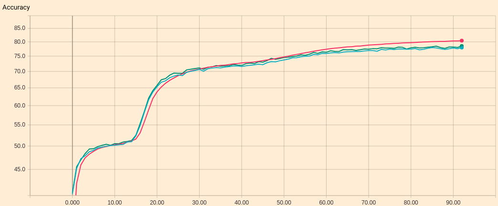

# Wild-Relation-Network

The repo is a PyTorch implementation of Wild Relational Network (WReN) introduced in DeepMind's [Measuring abstract reasoning in neural networks (ICML 2018)](http://proceedings.mlr.press/v80/santoro18a/santoro18a.pdf).

# Dependencies

**Important**
* PyTorch (0.4.1)
* TensorBoardX (and Tensorboard)

See ```requirements.txt``` for other dependencies.

# Usage

Run
```Bash
python main.py --model <WReN/CNN_MLP/Resnet50_MLP/LSTM> --img_size <input image size> --path <path to your dataset>
```

# Accuracy Plot

The following figure shows the WReN performance we got using the hyper-parameters in the paper.


